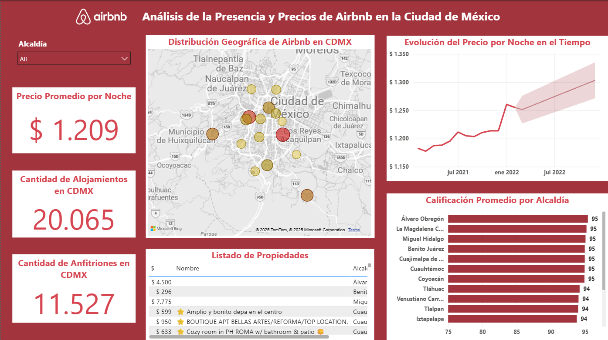

# 🏙️ Dashboard - Análisis y Precios de Airbnb en Ciudad de México

> ⚠️ **Aviso sobre los datos**: Los datos utilizados en este proyecto provienen de un curso de formación y están protegidos por derechos de autor. Por esta razón, los datos no se incluyen en este repositorio. El análisis y la visualización se muestran únicamente con fines demostrativos.

## 🎯 Desafío

Se requiere analizar y visualizar datos de Airbnb en Ciudad de México para responder las siguientes preguntas de negocio:

- ¿Cuál es la evolución de las rentas de Airbnb en la Ciudad de México?
- ¿Dónde incrementa el costo por noche?
- ¿Existe algún periodo específico en el tiempo donde el precio promedio por noche se incrementa?

## 📖 Descripción

Este proyecto presenta un análisis visual de la presencia de alojamientos de Airbnb en la Ciudad de México, basado en datos simulados o anonimizados con fines educativos y demostrativos. A través de un dashboard interactivo, se exploran diferentes indicadores clave del mercado de renta a corto plazo en la capital mexicana.

## 📊 ¿Qué incluye el dashboard?

- **Precio promedio por noche**  
- **Cantidad de alojamientos en CDMX**  
- **Cantidad de anfitriones en CDMX**  
- **Distribución geográfica**: Mapa de calor por alcaldía basado en el promedio de precio por noche.  
- **Evolución del precio en el tiempo**: Línea de tendencia con variación del precio promedio por noche, con una previsión a futuro.  
- **Calificación promedio por alcaldía**: Ranking de alcaldías según la puntuación promedio de sus alojamientos.  
- **Listado de propiedades**: Tabla con precios, nombres y alcaldías de las propiedades destacadas.  

## ⚙️ Tecnologías utilizadas

- Power BI Desktop  
- Power Query  
- Archivos CSV
- Lenguaje DAX

## 📝 Procesos destacados

- Carga de datos  
- Limpieza y transformación de datos  
- Uso de mapas  
- Implementación de líneas de tiempo y pronósticos  
- Uso de funciones DAX

## 📸 Dashboard Preview

# 🏙️ Dashboard - Airbnb Price Analysis in Mexico City

>⚠️ **Notice about the data**: The data used in this project comes from a training course and is protected by copyright. Therefore, it is not included in this repository. The analysis and visualizations are shared for demonstration purposes only.

## 🎯 Challenge

The project aims to analyze and visualize Airbnb data in Mexico City in order to answer the following business questions:

- How have Airbnb rental prices evolved in Mexico City?
- In which areas is the nightly cost increasing?
- Is there a specific time period when the average nightly price increases?

## 📖 Description

This project presents a visual analysis of Airbnb listings in Mexico City, based on simulated or anonymized data for educational and demonstrative purposes. Through an interactive dashboard, various key indicators of the short-term rental market in the Mexican capital are explored.

## 📊 What does the dashboard include?

- **Average price per night**  
- **Number of listings in Mexico City**  
- **Number of hosts in Mexico City**  
- **Geographic distribution**: Heat map by borough based on average nightly price.  
- **Price trend over time**: Trend line showing variation of average nightly price, with a future forecast.  
- **Average rating by borough**: Ranking of boroughs according to the average rating of their listings.  
- **Property listings**: Table with prices, names and boroughs of featured properties.

## ⚙️ Technologies used

- Power BI Desktop  
- Power Query  
- CSV files
- DAX language

## 📝 Key processes

- Data loading  
- Data cleaning and transformation  
- Use of maps  
- Implementation of timelines and forecasts  
- Use of DAX functions
